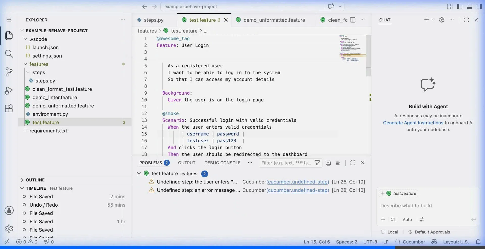
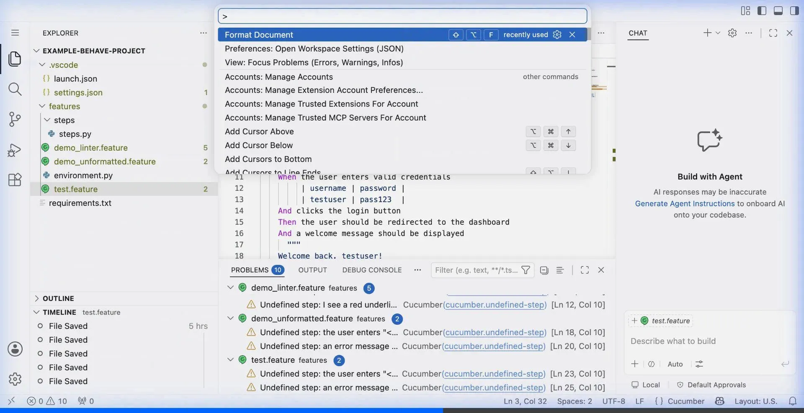

<div align="center">
  <br/><br/>

  <h1>Gherkin Beautifier</h1>
  <p><em>The professional formatting & productivity suite for Gherkin <code>.feature</code> files in VS Code.</em></p>

  <p>
    <a href="https://github.com/carlos-camara/vscode-gherkin-beautifier/actions/workflows/lint.yml">
      
    </a>
    <a href="https://github.com/carlos-camara/vscode-gherkin-beautifier/releases">
      
    </a>
    <a href="https://carlos-camara.github.io/vscode-gherkin-beautifier/">
      
    </a>
    <a href="https://marketplace.visualstudio.com/items?itemName=carloscamara.vscode-gherkin-beautifier">
      
    </a>
    <a href="./LICENSE">
      
    </a>
  </p>

  <p>
    <a href="https://marketplace.visualstudio.com/items?itemName=carloscamara.vscode-gherkin-beautifier"><strong>⚡ Install</strong></a>
    &nbsp;·&nbsp;
    <a href="https://carlos-camara.github.io/vscode-gherkin-beautifier/"><strong>📖 Docs</strong></a>
    &nbsp;·&nbsp;
    <a href="https://github.com/carlos-camara/vscode-gherkin-beautifier/issues/new?template=bug_report.yml"><strong>🐛 Bug</strong></a>
    &nbsp;·&nbsp;
    <a href="https://github.com/carlos-camara/vscode-gherkin-beautifier/issues/new?template=feature_request.yml"><strong>💡 Feature</strong></a>
    &nbsp;·&nbsp;
    <a href="./CHANGELOG.md"><strong>📋 Changelog</strong></a>
  </p>
</div>

---

**Gherkin Beautifier** transforms chaotic, hand-edited `.feature` files into perfectly aligned, professionally formatted BDD specifications — in milliseconds. Built natively for VS Code, it integrates directly with the editor's formatting API, linter, and navigation system.

Works with any Gherkin-based framework: **Cucumber** · **Behave** · **SpecFlow** · **Karate** · **pytest-bdd**

---

## ✨ What's inside

| | Feature | Description |
|:---:|---------|-------------|
| 🎨 | **Formatter** | Auto-indent, table alignment, auto-casing, tag wrapping |
| 🔍 | **Live Linter** | Real-time syntax errors before you run a single test |
| 🧭 | **Go To Definition** | Jump from `.feature` steps to Python implementations |
| 📊 | **Stats Dashboard** | Beautiful HTML metrics for your entire BDD workspace |
| 💡 | **Syntax Highlighting** | Curated VS Code color palette for dark themes |
| 📝 | **Snippets** | Instant scaffolding for `feature`, `scenario`, `outline`, `rule` |
| 🌐 | **i18n** | Format keywords in English, Spanish, French & German |

---

## 🎨 Formatter

Press `Shift+Alt+F` — your messy feature file becomes clean and professional instantly.

**Before**

```gherkin
feature: user authentication
@smoke @regression @login @security
given i am on the login page
when i enter "admin" as username
and i enter "secret" as password
then i should be redirected to dashboard
  |field  |value |
  |user   |admin |
```

**After**

```gherkin
Feature: User Authentication

    @login @regression @security
    @smoke
    Scenario: Successful login
        Given I am on the login page
        When  I enter "admin" as username
        And   I enter "secret" as password
        Then  I should be redirected to dashboard
              | field | value |
              | user  | admin |
```

<details>
<summary>See all formatting rules →</summary>

| Rule | Behavior |
|------|----------|
| **Keyword casing** | `given` → `Given`, `feature` → `Feature` across 10+ languages |
| **Step indentation** | All steps align to the same column (configurable, default 4 spaces) |
| **Table alignment** | Pipe tables dynamically pad to align with the preceding step keyword |
| **Tag wrapping** | Long `@tag` chains split across lines at 80 characters |
| **Blank lines** | Enforces consistent spacing between `Scenario` / `Rule` blocks |

</details>


---

## 🔍 Live Linter

Catch mistakes the moment you type them — no test run required.

- **Missing colons** → `Scenario` flagged, `Scenario:` accepted
- **Invalid keywords** → typos like `Givne` or `Wen` highlighted immediately
- **Problems panel** integration → `Ctrl+Shift+M` / `Cmd+Shift+M`
- **Gutter indicators** → red marks in the scroll bar for quick scanning


---

## 🧭 Go To Definition

`Cmd+Click` (macOS) or `Ctrl+Click` (Windows/Linux) on any Gherkin step to jump directly to its Python implementation.

```gherkin
# features/login.feature
Given I login as "admin"         ← Cmd+Click
```

```python
# steps/auth_steps.py            ← lands here instantly
@given('I login as "{user}"')
def step_login(context, user):
    ...
```

> Works with **Behave** step decorators (`@given`, `@when`, `@then`, `@step`) in any `steps/` subdirectory.



---

## 📊 Statistics Dashboard

**Right-click** inside any `.feature` file → *Gherkin: Show Project Statistics*, or open it from the Command Palette (`Ctrl+Shift+P`).

Get a live HTML report across your entire workspace:

| Metric | What it counts |
|--------|---------------|
| Features | All `Feature:` blocks |
| Rules | All `Rule:` blocks |
| Scenarios | All `Scenario:` and `Scenario Outline:` blocks |
| Files | Total `.feature` files scanned, including unsaved buffers |



---

## 💡 Syntax Highlighting

A hand-tuned color palette designed for VS Code dark themes. Every Gherkin token gets a distinct, readable color.

| Token | Color | Preview |
|-------|-------|---------|
| `Feature`, `Scenario`, `Rule`, `Background` | Purple `#C586C0` | Structure |
| `Given`, `When`, `Then`, `And`, `But` | Blue `#569CD6` | Actions |
| `@smoke`, `@api`, `@wip` | Cyan `#4EC9B0` | Tags |
| `"""` docstrings | Orange `#CE9178` | Strings |


---

## ⌨️ Keyboard Shortcuts

| Action | macOS | Windows / Linux |
|--------|:-----:|:---------------:|
| Format document | `Shift+Alt+F` | `Shift+Alt+F` |
| Go To Definition | `Cmd+Click` / `F12` | `Ctrl+Click` / `F12` |
| Show Statistics | Command Palette | Command Palette |
| Format on right-click | Context Menu | Context Menu |

---

## ⚙️ Configuration

Works perfectly out-of-the-box. Fine-tune via `settings.json`:

| Setting | Default | Description |
|---------|:-------:|-------------|
| `gherkinBeautifier.indentation.steps` | `4` | Spaces to indent step lines |
| `gherkinBeautifier.tables.alignToKeyword` | `true` | Align pipe tables to the preceding step column |
| `gherkinBeautifier.emptyLines.betweenScenarios` | `1` | Blank lines between `Scenario` / `Rule` blocks |
| `gherkinBeautifier.tags.format` | `"wrap"` | `"wrap"` splits at 80 chars · `"singleLine"` keeps on one line |

**Enable Format on Save (recommended):**

```jsonc
// .vscode/settings.json
{
  "[feature]": {
    "editor.defaultFormatter": "carloscamara.vscode-gherkin-beautifier",
    "editor.formatOnSave": true
  }
}
```

---

## 🚀 Installation

**Via VS Code Marketplace** *(recommended)*

1. Open VS Code → Extensions (`Ctrl+Shift+X` / `Cmd+Shift+X`)
2. Search **"Gherkin Beautifier"** and click **Install**

**Via CLI:**

```bash
code --install-extension carloscamara.vscode-gherkin-beautifier
```

**Via `.vsix` file:**

```bash
code --install-extension gherkin-beautifier-1.5.0.vsix
```

---

## 🗺️ Roadmap

| Status | Feature | Notes |
|:------:|---------|-------|
| ✅ | Native Formatter | AST-based, `Shift+Alt+F` |
| ✅ | Live Linter | Real-time diagnostics |
| ✅ | Go To Definition | Behave / Python |
| ✅ | Statistics Dashboard | HTML Webview |
| ✅ | Syntax Highlighting | Dark theme palette |
| 🔜 | **Test Explorer** | ▶ Run scenarios from the editor gutter |
| 🔜 | **IntelliSense** | Step autocomplete as you type |
| 🔜 | **Quick Fixes** | Auto-generate missing Python step stubs |

---

## 🤝 Contributing

All contributions are welcome — bug reports, feature requests, documentation, or code.
Read [CONTRIBUTING.md](./CONTRIBUTING.md) to get started.

## 📄 License

[MIT](./LICENSE) © [Carlos Camara](https://github.com/carlos-camara)

---

<div align="center">
  <a href="https://carlos-camara.github.io/vscode-gherkin-beautifier/">📖 Documentation</a>
  &nbsp;·&nbsp;
  <a href="https://github.com/carlos-camara/vscode-gherkin-beautifier/issues">🐛 Issues</a>
  &nbsp;·&nbsp;
  <a href="https://github.com/carlos-camara/vscode-gherkin-beautifier/discussions">💬 Discussions</a>
  &nbsp;·&nbsp;
  <a href="./CHANGELOG.md">📋 Changelog</a>
  &nbsp;·&nbsp;
  <a href="https://marketplace.visualstudio.com/items?itemName=carloscamara.vscode-gherkin-beautifier">🛒 Marketplace</a>
</div>
