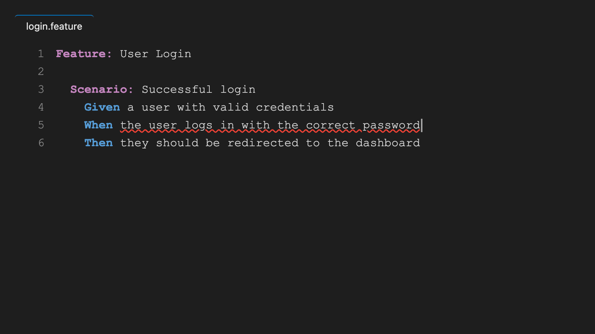

<!-- markdownlint-disable MD033 MD041 -->

<div align="center">

<br/>

# Ship BDD Faster with Gherkin PowerTools

**The all-in-one VS Code extension for formatting, validating, and debugging Gherkin feature files—with deep, first-class support for Python Behave.**

<br/>

[](https://marketplace.visualstudio.com/items?itemName=carloscamara.vscode-gherkin-powertools)
[](https://marketplace.visualstudio.com/items?itemName=carloscamara.vscode-gherkin-powertools)
[](https://marketplace.visualstudio.com/items?itemName=carloscamara.vscode-gherkin-powertools)

**[Read Documentation](https://carlos-camara.github.io/vscode-gherkin-powertools/) • [Report Issue](https://github.com/carlos-camara/vscode-gherkin-powertools/issues) • [GitHub Repository](https://github.com/carlos-camara/vscode-gherkin-powertools)**

<br/>



*Automatically generate missing Python Behave steps directly from your feature files with a single keystroke.*

</div>

---

## Why Gherkin PowerTools?

Instead of wrestling with configuration or terminal output, Gherkin PowerTools lets you focus on delivering behavior:

* **Never Write a Regex Manually Again:** Auto-generate Python step definitions directly from undefined Gherkin steps.
* **Catch Errors Before CI:** Real-time linting catches malformed scenarios, missing colons, and inconsistent tables as you type.
* **Navigate Codebases Instantly:** Context-aware IntelliSense and <kbd>Cmd+Click</kbd> navigation bridge the gap between plain-text `.feature` files and Python backend logic.
* **Visual Testing Without the Terminal:** Run, debug, and trace your Behave scenarios directly from the VS Code Test Explorer.

---

## Two-Tiered Capabilities

Gherkin PowerTools provides functionality depending on your technology stack:

### 🌍 For All BDD Frameworks (Cucumber, SpecFlow, Playwright BDD)
Framework-independent tools for any project using standard `.feature` files:
* **Smart AST-Powered Formatting:** Align tables and standardize indentation instantly.
* **Real-time Structural Linting:** Catch malformed syntax before committing.
* **Document Outline:** Navigate scenarios and example rows efficiently.
* **Workspace Analytics:** Understand the structure and tag distribution of your BDD suite.

### 🐍 Exclusive to Python Behave
Deep, localized integration designed exclusively for Python Behave test suites:
* **Deep Step Discovery & IntelliSense:** Autocomplete steps using smart context-aware ranking based on your recent usage.
* **1-Click Python Step Generation:** Generate valid Python stubs for undefined steps seamlessly.
* **Integrated Test Explorer & Debugger:** Run or debug scenarios visually from the sidebar, with live step tracking.
* **Real-time Context State Inspection:** Inspect internal state variables injected directly into the output panel during execution.

---

## Quick Start

1. **Install** Gherkin PowerTools from the [VS Code Marketplace](https://marketplace.visualstudio.com/items?itemName=carloscamara.vscode-gherkin-powertools).
2. **Open** any `.feature` file to activate the extension.
3. **Format** the document by pressing <kbd>Shift+Alt+F</kbd> (<kbd>⇧⌥F</kbd> on macOS).

*Note: For Python Behave projects, the extension automatically discovers your step definitions. Check the [Configuration](#configuration) section if your files are in a custom location.*

---

## Detailed Features

### Missing Python Step Generation
Write a Gherkin step. The linter underlines it if the Python implementation is missing. Press <kbd>Ctrl+.</kbd> (<kbd>Cmd+.</kbd> on macOS) to automatically generate a valid Python stub with the extracted regex parameters directly in your steps folder.

### Behave Test Explorer, Run, and Debug
Open the Testing panel to view a live tree of your features, rules, scenarios, and example rows. Click the Play button to execute, or the Bug icon to attach the Python debugger with full breakpoint support.

<div align="center">
  
</div>

### Python Navigation and IntelliSense
The extension suggests matching steps from your Python backend as you type. Unlike standard autocomplete, Gherkin PowerTools uses **Smart Context-Aware Ranking** to prioritize steps based on your recent usage, the current feature file, and semantic tag affinity.

<kbd>Ctrl+Click</kbd> (<kbd>Cmd+Click</kbd> on macOS) any step to jump to its Python definition, or hover to preview the function signature and docstring.

<div align="center">
  
</div>

### Real-Time Gherkin Diagnostics and Quick Fixes
A dialect-aware AST linter flags structural errors across 70+ Gherkin languages. Identify misspelled keywords, malformed tables, and undefined steps immediately. Use Quick Fixes to correct common issues.

<div align="center">
  
</div>

### Gherkin Formatter
Align tables, wrap long tags, and standardize indentation using the built-in formatter. Configure formatting profiles to share a consistent baseline across your team.

<div align="center">
  
</div>

### Gherkin Health & Recommendation Engine
Generate a comprehensive, interactive Webview report to ensure your project is healthy and maintainable. This dashboard analyzes your source structure to calculate your Overall Health, Maintainability, Complexity, and Technical Debt. It also automatically persists lightweight historical snapshots to visualize your project's evolution over time via interactive trend charts.

<div align="center">
  
</div>

---

## Configuration

You can configure the extension in your VS Code settings, or commit a `.gherkin-powertoolsrc.json` to your project root to share formatting rules with your team:

```json
{
  "profile": "team",
  "behave": {
    "stepGlobs": [
      "**/steps/**/*.py",
      "**/features/steps/**/*.py",
      "**/integration_tests/steps/**/*.py"
    ]
  }
}
```

For a complete list of settings, visit the [Configuration Reference](https://carlos-camara.github.io/vscode-gherkin-powertools/configuration/).

---

## Support and Contributions

* 📖 **[Read the Full Documentation](https://carlos-camara.github.io/vscode-gherkin-powertools/)**
* 💬 **[Join GitHub Discussions](https://github.com/carlos-camara/vscode-gherkin-powertools/discussions)**
* 🐛 **[Report an Issue](https://github.com/carlos-camara/vscode-gherkin-powertools/issues)**

Contributions are welcome! Please read the [Contributing Guide](https://github.com/carlos-camara/vscode-gherkin-powertools/blob/main/CONTRIBUTING.md) before submitting a pull request.

---

<div align="center">

**Enjoying Gherkin PowerTools?** [Leave a rating on the Marketplace!](https://marketplace.visualstudio.com/items?itemName=carloscamara.vscode-gherkin-powertools&ssr=false#review-details) ⭐⭐⭐⭐⭐

</div>
