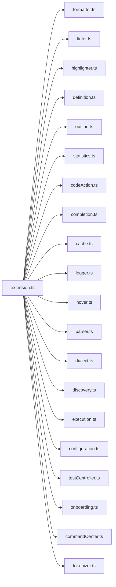
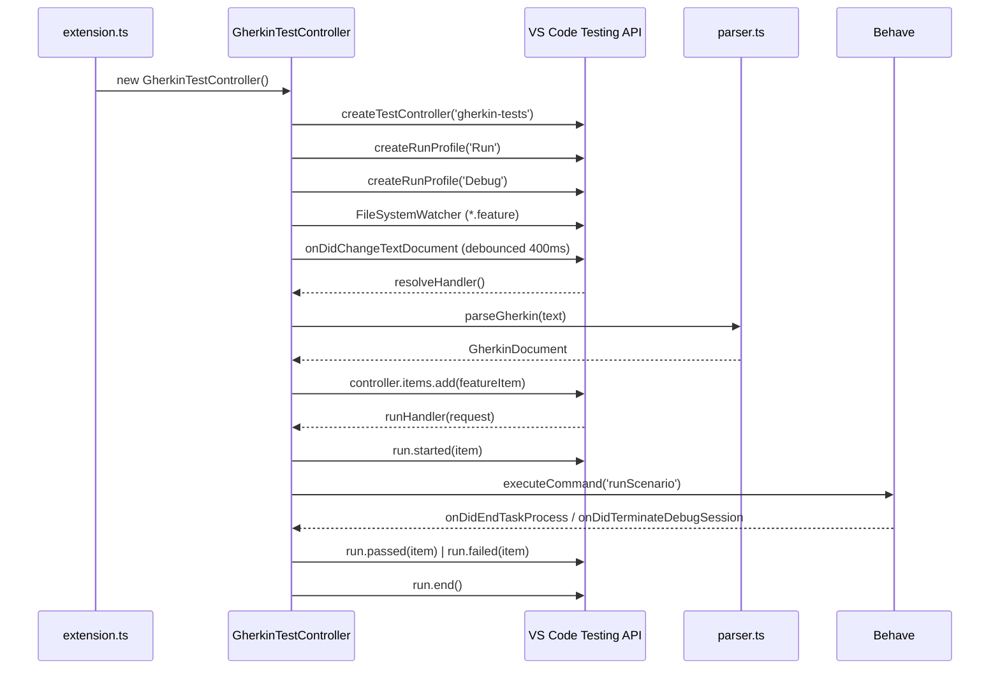
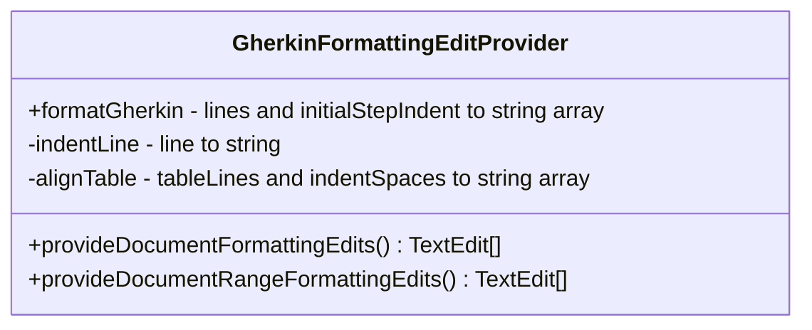
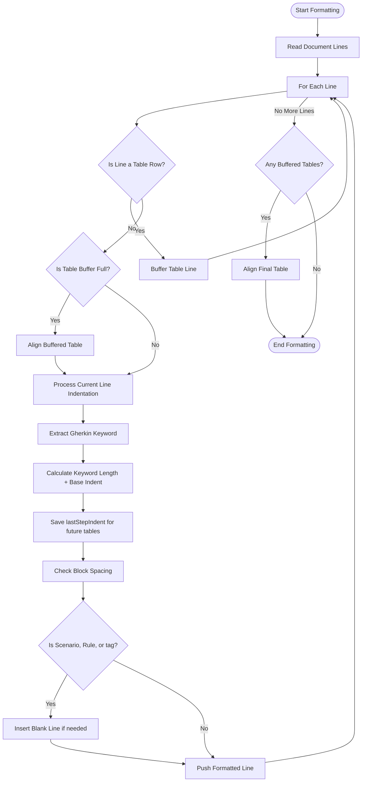

# Architecture

This document describes the internal architecture of the **Gherkin PowerTools** Visual Studio Code extension.

## High-Level Architecture

The extension is built around three foundational pillars:

1. **Hybrid Parsing Engine** — A dual-mode parser combining the official `@cucumber/gherkin` AST for strict validation with a resilient text-based fallback scanner that keeps all features working even when the user is mid-keystroke on a malformed line.
2. **Lazy-Initialized In-Memory Symbol Cache** — An asynchronous, on-demand indexing engine that resolves Python step definitions in RAM for sub-millisecond lookups across Go-To-Definition, Hover, IntelliSense, and the Linter. Initialization is deferred until after VS Code startup to guarantee near-zero extension host activation time.
3. **Native VS Code Integration** — Registers standard VS Code extension points (formatting providers, diagnostic providers, test controllers, code action providers) to deliver a first-class editor experience without proprietary protocols.

### Module Map



| Module | Responsibility |
|--------|---------------|
| `extension.ts` | Entry point. Bundled via **Esbuild** for fast activation. Registers all commands, providers, and diagnostics. Defers heavy I/O to a 2-second background timer. |
| `formatter.ts` | Core formatting engine: indentation, table alignment, tag wrapping |
| `highlighter.ts` | Custom semantic syntax highlighting via `createTextEditorDecorationType` |
| `linter.ts` | Real-time syntax checking via `@cucumber/gherkin` AST, with fallback text scanning. Semantic (undefined step) checks are skipped until the Symbol Cache is ready. |
| `definition.ts` | Go-To-Definition provider: calls `ensureInitialized()` then queries `cache.ts` |
| `outline.ts` | Hierarchical tree of `Feature > Rule > Scenario` for the Outline panel |
| `statistics.ts` | Interactive HTML Webview dashboard displaying heuristic workspace metrics |
| `codeAction.ts`| Generates quick fixes (💡) for undefined steps or syntax typos |
| `completion.ts`| Smart IntelliSense autocompletion parsing regex into Snippets; calls `ensureInitialized()` on demand |
| `cache.ts`     | Lazy-initialized asynchronous caching engine with `ensureInitialized()` guard, debounce, live un-saved document preference, and partial AST fallback. Indexes the workspace via `vscode.workspace.findFiles` and listens to `vscode.workspace.fs`. Contains both `SymbolCache` (Python step definitions) and `FeatureCache` (tag blast radius data). |
| `logger.ts`    | Native VS Code Output Channel for tracing |
| `hover.ts`     | Provides hover information (function signatures, docstrings, tag blast radius); calls `ensureInitialized()` on demand |
| `parser.ts`    | Handles AST parsing and caching of Gherkin documents |
| `dialect.ts`   | Provides i18n support by matching localized Gherkin keywords |
| `discovery.ts` | Centralized Behave file discovery service handling glob normalization and reactive file watchers |
| `execution.ts` | Orchestrates VS Code Tasks via array-based `ProcessExecution` APIs for secure Behave test runs. Provides `runBehaveForTestRun()` (captures stdout/stderr for the Test Results panel) and `debugBehave()` (launches a debug session without creating a TestRun, preserving previous test history). |
| `configuration.ts`| Provides typesafe access to user and workspace configuration settings |
| `testController.ts` | Registers the native VS Code Test Controller (`GherkinTestController`). Populates the Testing sidebar with a live feature/scenario tree. Listens to `onDidChangeTextDocument` (400 ms debounce) for real-time updates before save. |
| `onboarding.ts` | Detects misconfigured step globs on workspace open and surfaces a single non-blocking notification with 1-click fix options |
| `commandCenter.ts` | Unified QuickPick interface exposing all extension capabilities from a single searchable entry point |
| `tokenizer.ts` | Custom bounded Python tokenizer for extracting step patterns from decorator literals without a full Python AST |
## Hot-Reloading Configuration

The extension is designed to respond to configuration changes instantly without requiring a window reload.
When settings like `gherkinPowerTools.behave.stepGlobs` are modified, `extension.ts` interacts with `discovery.ts` to immediately tear down old file system watchers, instantiate new ones, and instruct the `SymbolCache` to re-index the workspace and trigger live re-linting of all open feature documents.

---

## Lazy Initialization Architecture

To guarantee near-zero extension host activation time, Gherkin PowerTools defers all heavy I/O until after VS Code has fully started up.

### Startup Sequence

```text
activate()  ─────────────────────────────────────────────────────────────────────────►
  │
  ├─ Register formatters, linters, language providers (instant, no I/O)
  │
  ├─ Register commands (instant)
  │
  └─ setTimeout(2000ms) ─────────────────────────────────────────────────────────────►
                              │
                              ├─ SymbolCache.ensureInitialized()   (scan *.py files)
                              │    └─ Watchers registered after index is ready
                              │
                              └─ FeatureCache.ensureInitialized()  (scan *.feature files)
                                   └─ FileSystemWatcher registered after index is ready
```

### On-Demand Provider Pattern

All language providers use `ensureInitialized()` — a guard method that:
- Returns the cached result immediately if initialization has already completed.
- Awaits the background initialization promise if it is still in progress.
- Triggers initialization if the cache was never started (e.g. a provider was invoked before the 2-second timer fired).

```typescript
// Example: hover provider
public async provideHover(...) {
    const blastRadius = await this.featureCache.getTagBlastRadius(tagName);
    // FeatureCache internally calls ensureInitialized() before returning data
}
```

This means the extension is always responsive — if a user types in a `.feature` file immediately after opening VS Code, the cache initializes on-demand without any manual trigger.

## Test Controller Architecture

The `GherkinTestController` (`testController.ts`) bridges the standard VS Code Testing API with the Gherkin workspace:



### Key Design Decisions

- **Split Run/Debug model**: The `▶ Run` profile creates a `TestRun` and reports pass/fail results to the Test Results panel. The `🐞 Debug` profile bypasses `TestRun` entirely — it calls `debugBehave()` directly, so the debug session **never overwrites previous test history**. Existing green ✅ badges remain intact after debugging.
- **Pre-registered start listener**: `onDidStartDebugSession` is registered **before** `await startDebugging()` to eliminate a race condition where a fast-starting debug session fires the event before the extension's listener is attached.
- **Object-identity session tracking**: The debug termination listener matches sessions by object reference (`session === activeSession`), not by name string. This prevents false-negative detection when the Python extension (`ms-python.debugpy`) internally renames the debug session.
- **Debug Console auto-focus**: After `startDebugging()` succeeds, `workbench.panel.repl.view.focus` is executed to switch the user's view to the Debug Console immediately.
- **Two-event model**: `waitForTaskEnd()` listens to `onDidEndTaskProcess` (Tasks only); `waitForDebugEnd()` listens to `onDidTerminateDebugSession` (debug sessions only). Using the wrong event causes the spinner to linger for 5 minutes.
- **Debounced text change listener**: `onDidChangeTextDocument` fires on every keystroke. A 400 ms timer is reset on each event per URI, so the tree is only re-parsed when the user pauses typing.
- **In-memory text over disk reads**: The text-change listener passes `event.document.getText()` directly to `parseTestsInDocumentContent()`, bypassing the disk. This keeps the tree in sync with unsaved edits.
- **Safety timeout**: Both wait methods include a 10-minute `setTimeout` fallback to guarantee `run.end()` is always called, even if an external process hangs.


## Semantic Step Matching

In traditional Gherkin engines, steps are resolved solely by matching regex patterns against the trailing text. However, frameworks like Behave allow identically worded steps differentiated only by their semantic decorator (`@given("I log in")` vs `@when("I log in")`).
Gherkin PowerTools correctly respects these semantic constraints. The `DialectService` traverses backwards through the Gherkin document to resolve contextual semantic types for continuation keywords (`And`, `But`).
This inferred semantic type is passed synchronously into the `SymbolCache`, which strictly filters autocomplete snippets, hover documentation, Go-To-Definition links, and Linter diagnostics to only present perfectly valid contexts without throwing ambiguous step errors.
Generic `@step` decorators are treated as wildcards.

## Python Bounded Tokenization

To securely and accurately extract step patterns from Python files without the overhead of a full AST parser, the extension uses a custom bounded tokenizer (`src/tokenizer.ts`).
This tokenizer reliably parses Python decorators and string literals, accommodating complex string prefixes (`r`, `u`, `f`, `b`, `rf`), multiline triple quotes (`"""` or `'''`), and internal escape sequences.

Dynamic Python expressions (e.g., `@given(MY_CONSTANT)` or function calls) cannot be statically evaluated into text patterns. The tokenizer detects these non-literal expressions and automatically flags them as `evaluable: false`. Like regex compilation errors, these dynamic steps are preserved in the symbol cache for structural navigation but are safely excluded from live text matching loops.

## Resilient Regex Compilation

Because the extension runs in Node.js, `StepDefinition` patterns written in Python sometimes utilize regular expression constructs that are inherently incompatible with the JavaScript V8 engine (e.g., negative lookbehinds like `(?<!...)` or unsupported group syntax).
Rather than silently dropping these patterns during cache index compilation (which causes the step to vanish entirely from the editor), the `SymbolCache` explicitly isolates the `RegExp` compilation in a sandbox.
If compilation throws a `SyntaxError`, the extension flags the `StepDefinition` as `evaluable: false` and preserves it in the cache along with the `compilationError`.
This guarantees the symbol remains accessible to workspace symbol resolution and global autocompletion routines, while safely skipping execution loops (such as real-time text matching for Linter, Hover, and Go-To-Definition logic) that would otherwise crash.

## The Formatting Engine

While parsing relies on the AST for semantic validation, the `formatter.ts` leverages regex-based token extraction combined with AST localization to perform block-spacing and table alignment without altering invalid lines.



The core logic implements two key VS Code interfaces:

1. `vscode.DocumentFormattingEditProvider` (Full file formatting)
2. `vscode.DocumentRangeFormattingEditProvider` (Selection formatting)

## Line Parsing Workflow



## Table Alignment Algorithm

The most complex part of the extension is the dynamic table alignment algorithm.

### Example Trace

Given the following raw input:

```gherkin
Given I have a database
|id|name|
|1|admin|
```

1. The parser hits `Given I have a database`
2. It applies a base indent of `4 spaces`
3. It runs a regex to capture the keyword `Given` (length 5)
4. It calculates: `baseIndent (4) + keywordLength (5) + space (1) = 10`
5. `lastStepIndent` is stored as `10`
6. The parser buffers the table rows
7. Upon hitting the end, it flushes to `alignTable(buffer, 10)`
8. `alignTable` splits columns by `|`, calculates max widths, and pads with `.padEnd()`

Result:

```gherkin
    Given I have a database
          | id | name  |
          | 1  | admin |
```
