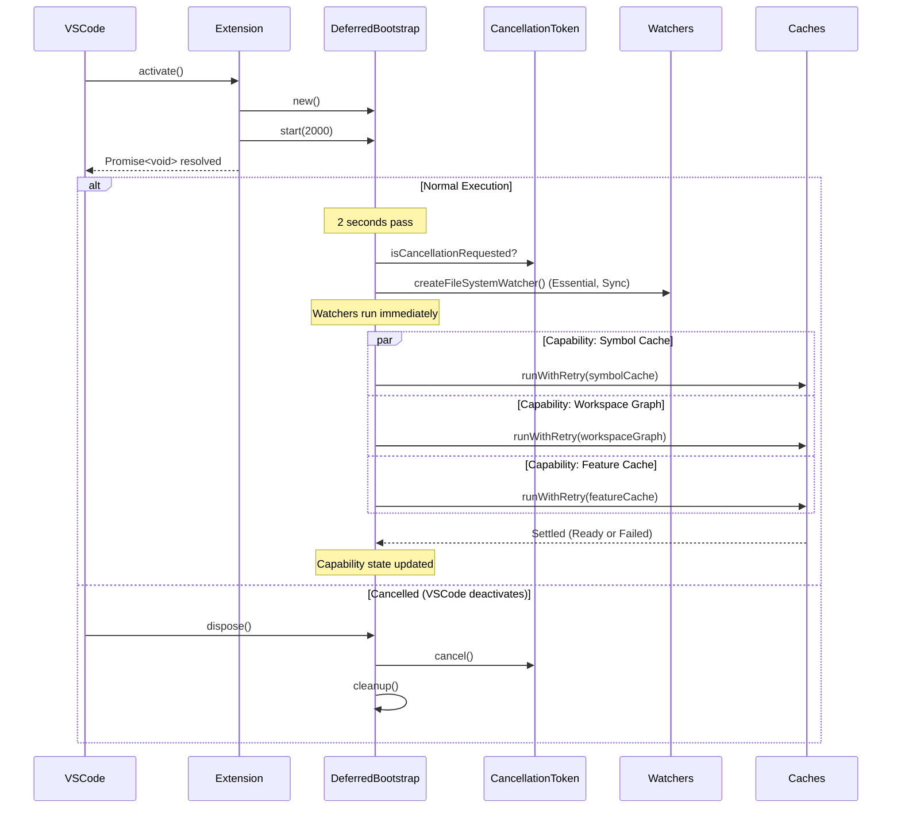

# Architecture

This document describes the high-level architecture of Gherkin PowerTools, focusing on how its internal services interact.

## Workspace Event Bus

To maintain high performance and decouple domain services from VS Code's extension lifecycle and file system watchers, Gherkin PowerTools uses a centralized **Workspace Event Bus** (`WorkspaceEventBus`).

### Why an Event Bus?
In earlier versions, each feature (like the Test Controller, Symbol Cache, and Linter) maintained its own `vscode.FileSystemWatcher` and subscribed independently to `vscode.workspace.onDidChangeTextDocument`. This caused:
- **Redundant Disk I/O:** Multiple services independently scanned the disk when files changed.
- **Race Conditions:** Different services updated their internal states at different times.
- **Memory Leaks:** It was difficult to ensure all watchers were properly disposed when features were toggled on or off.

### How the Event Bus Works
1. **Centralized Watchers (`extension.ts` and `discovery.ts`):**
   The extension initializes exactly *one* set of VS Code file system watchers and text document listeners. These are orchestrated from the composition root (`extension.ts`) and specific services (`discovery.ts`).
2. **Event Routing:**
   When a relevant VS Code event occurs (e.g., a `.feature` file is saved or a `step` file is modified), the root watchers convert it into a strongly typed `WorkspaceEvent` (e.g., `featureFileChanged` or `stepFileDeleted`).
3. **Publishing:**
   This event is published to the `WorkspaceEventBus`.
4. **Subscription & Debouncing:**
   Domain services inject the Event Bus as a dependency during initialization (`setEventBus`). They listen for specific event types. Services like the `GherkinLinter` or `FeatureCache` handle their own internal debouncing logic to ensure that rapid typing in the editor only triggers expensive operations (like AST parsing) once the user pauses.

### Event Payloads
The `WorkspaceEvent` union type includes payloads for:
- **Feature Files (`featureFileCreated`, `featureFileChanged`, `featureFileDeleted`)**: Triggers Test Explorer updates and Feature Cache invalidation.
- **Step Files (`stepFileCreated`, `stepFileChanged`, `stepFileDeleted`)**: Triggers Python parsing in the Symbol Cache to update step definitions.
- **Configuration (`configurationChanged`)**: Triggers full cache flushes when critical settings like `stepGlobs` are modified.
- **Editor State (`textDocumentOpened`, `textDocumentChanged`, `activeEditorChanged`)**: Drives real-time diagnostic linting and semantic highlighting.

### Execution Output & Custom Formatting
When running Behave tests through the Test Explorer, the extension spawns Behave as a child process and injects a custom Python formatter (`vscode_behave_formatter.py`).
To eliminate fragility caused by standard output corruption, this formatter establishes a robust, bidirectional TCP socket connection with the extension.
It translates Python-side test results and the final **Context Snapshot** into strictly-typed NDJSON (Newline Delimited JSON) events.
These `ProtocolEnvelope` payloads are flushed safely over the socket, enabling the Test Controller to seamlessly bridge real-time execution states and context variables into the VS Code UI without relying on fragile stdout parsing.

#### Graceful Degradation & Compatibility
To interact with the Behave runtime, the formatter must access internal private APIs (such as `_step_index`, `_lines`, and `hook_failures`). Because these variables are undocumented and subject to change in community forks (like Behave `1.3.3`) or future releases, the formatter uses a `BehaveCompatibilityAdapter`.
This adapter safely isolates all private access. If an internal variable is missing or altered, the adapter invokes a **Graceful Degradation** fallback. Instead of crashing the test runner, core execution tracking continues flawlessly, and only the optional UI telemetry (such as precise line tracking or Context Snapshots) degrades.

### Secure Execution Gateway & Workspace Trust
To mitigate command injection vulnerabilities and protect users from malicious workspaces, test execution runs through a **Secure Execution Gateway**:
1. **Workspace Trust Integration**: Before any process is spawned, the extension verifies the environment using VS Code's native `workspace.isTrusted` API. Test execution is strictly blocked in untrusted workspaces.
2. **Structured Execution Model**: Instead of parsing free-form shell commands, the extension enforces a structured `behave.execution` object (separating the `executable` and its `arguments`).
3. **Safe Process Spawning**: The underlying child process is spawned securely using `cp.spawn` with `shell: false`, ensuring arguments are passed directly to the executable without shell evaluation, thereby neutralizing injection vectors.
4. **Machine-Specific Configuration Isolation**: To prevent absolute executable paths (e.g., local Python interpreters) from being inadvertently committed to version control in shared `.gherkin-powertoolsrc.json` or `.vscode/settings.json` files, the execution model introduces a strict `behave.localExecution` override scoped exclusively to the user's machine settings.
5. **Zero-Config Virtual Environment Discovery**: To eliminate manual setup, the extension leverages the official Microsoft Python API to detect the active virtual environment. If a global interpreter is active, Gherkin PowerTools automatically scans the workspace and prioritizes local virtual environments (like `.venv`, `venv`, `env`) implicitly.

### Execution Termination & Process Cleanup
To prevent orphaned Python processes, particularly when running long E2E tests or terminating tests prematurely, the extension employs a robust cross-platform **Process Tree Cleanup** mechanism.
When a test execution is cancelled or times out (configured via `gherkinPowerTools.behave.executionTimeout`), the extension does not simply kill the parent process. Instead, it locates all descendent processes and issues a recursive termination:
- **POSIX Systems**: The process is spawned in detached mode with its own process group ID (`pgid`), allowing the extension to send `SIGKILL` to the entire group (`-pid`).
- **Windows Systems**: The extension leverages the native `taskkill /pid <PID> /T /F` command to forcefully terminate the entire process tree.

Furthermore, `runBehaveForTestRun` utilizes a strict `ExecutionOutcome` discriminated union (`success`, `failure`, `timeout`, `cancelled`, `launch_failure`, `process_error`, `protocol_failure`) instead of ambiguous exit codes. This strictly isolates infrastructure failures (like timeouts or cancellations) from actual test assertion failures, ensuring that the Test Explorer always reflects the true reason for a failed run.

### Test Selection Normalization Layer
VS Code's `TestRunRequest` can contain complex overlapping inclusion and exclusion trees (e.g. running a whole Feature but excluding a specific Scenario, while also explicitly running an Example row).
To prevent redundant child process executions and ensure mathematically correct test selection, the extension utilizes a dedicated `TestSelectionNormalizer` driven by a canonical `TestIdentity` abstraction.
1. **URI-Based TestIdentity:** Every test item node receives a deterministic query-string based ID (e.g., `file:///path/to/feature.feature?type=scenario&line=15`) that resolves unambiguously without fragment collisions.
2. **Top-Down Tree Traversal:** The normalizer walks the Test Explorer hierarchy from the requested root elements.
3. **Deep Exclusion Pruning & Structural Decomposition:** If a node is included but contains explicitly excluded descendants, the layer dynamically decomposes the parent node into its non-excluded siblings.
   Critically, because Behave cannot execute abstract structural nodes like `Rule` or `Scenario Outline` independently by their declared line numbers, the normalizer seamlessly unpacks these nodes into their runnable leaf descendants (individual scenarios or example rows).
   This prevents the parent process from indiscriminately running the whole block.
4. **Duplicate Prevention:** By normalizing overlapping includes, the layer prevents tests from being executed multiple times simultaneously.
5. **Deterministic Ordering:** The normalizer guarantees that tests are enqueued in strict document-line order (lexicographically by URI and ascending by line number), matching exactly how they appear in the `.feature` file regardless of the order they were selected in the UI.

### Performance Characteristics
- **Debounced Updates**: Groups rapid file system events (e.g. typing or git checkouts) into 300ms windows to prevent thrashing.
- **Incremental Indexing**: Uses a diffing algorithm (via `computeDiff()`) so that only new, modified, or deleted Python files trigger regex extraction. Unchanged files are skipped entirely.
- **Resource Identity Canonicalization**: Utilizes the `ResourceIdentity` abstraction to determine canonical URIs dynamically. It correctly enforces case-sensitivity on Linux, WSL, and remote filesystems, while safely applying case-insensitive lowercasing only on macOS and Windows. This prevents duplicate keys and collision bugs across different operating systems.
- **Garbage Collection**: Deletes stale `StepDefinition` instances from memory when their parent file is deleted or when the workspace changes.

### Live Step Tracking
As the custom formatter receives step events, it emits a `step_start` payload precisely before a Python step function runs. The Test Controller listens to this and dynamically creates a transient text decoration in the active `vscode.TextEditor`. This achieves the real-time "animation" of tests moving down the Gherkin feature file.

### Context-Aware Completion Ranking
To provide intelligent Behave step autocomplete locally and deterministically, the extension implements a local `CompletionRankingService` backed by the `WorkspaceGraph`.
1. **WorkspaceGraph (Transactional Snapshot Model)**: Hooked into the `WorkspaceEventBus`, the graph lazily maps Gherkin steps to their Python `StepDefinition` implementations. It uses a **FeatureSnapshot** model that accurately maps resolved definition frequency and tag affinity on a per-resource basis.
   When a file is modified or deleted, the graph applies an atomic mathematical subtraction of the previous snapshot before adding the new state, guaranteeing that global frequency counters never leak memory or become corrupted over time.
2. **LRU Cache Tracking**: When a user accepts a completion, an internal command (`gherkinPowerTools.internal.recordCompletion`) is fired, updating a Least Recently Used (LRU) cache to ensure recently used steps get a high priority boost.
3. **Deterministic Lexicographical Ranking**: When the user requests autocomplete, the `CompletionRankingService` applies a strict 5-tier Lexicographical Ranking model rather than an additive score. This ensures semantic relevance never gets outweighed by raw popularity:
   - **Tier 1 (Text Compatibility)**: Exact matches, token prefixes, or fuzzy compatibility with the typed text.
   - **Tier 2 (Semantic Compatibility)**: Evaluates strict Given/When/Then compatibility vs. generic `@step`.
   - **Tier 3 (Matcher Specificity)**: Penalizes highly greedy regex patterns compared to specific matchers.
   - **Tier 4 (Context Affinity)**: Rewards steps heavily used in the current `.feature` file or neighboring scenarios.
   - **Tier 5 (Learned Signals)**: Evaluates global usage counts across the workspace and LRU (Least Recently Used) cache presence.
   The resulting tier mapping (e.g., `00-00-01-02-99-pattern`) is assigned to the `sortText` property, forcing VS Code's IntelliSense to present the most relevant steps at the top without floating-point arithmetic conflicts.

4. **Hot-Path Context Bounding (`CompletionContextCache`)**: To eliminate `O(N)` regex scanning of large documents
   during the interactive IntelliSense hot-path, the completion engine employs a strict `CompletionContextCache`.
   On the first completion request for a document version, it extracts semantic tags and local step texts directly
   from the memoized `AstRepository`. It caches this `CompletionContextSnapshot` bound to the document version.
   Subsequent keystrokes fetch this context in `O(1)` time (~0.0004ms), rendering the autocomplete engine completely
   independent of file size, even on 10,000+ line documents. It guarantees correctness by falling back to text-based
   regex if the AST is severely malformed.

### Lifecycle & Disposal
Every service that calls `eventBus.onEvent()` tracks its subscription with an `eventBusDisposable`. When a service is disposed, it automatically unregisters itself from the Event Bus. When the extension deactivates, the Event Bus itself is disposed, severing all active subscriptions and preventing memory leaks.

## First-Run Onboarding Experience

To provide a zero-configuration setup experience, Gherkin PowerTools includes a dedicated `FirstRunExperience` module.

### How Onboarding Works
1. **Lazy Loading:** The onboarding check is deferred using the `DeferredBootstrap` orchestration layer inside the extension's activation lifecycle. This ensures that the heavy work of scanning the workspace for Python Behave indicators does not block VS Code's critical startup path, adhering to strict performance best practices.
2. **State Tracking:** The extension queries `context.globalState` to determine if the user has previously completed or dismissed the onboarding.
3. **Workspace Discovery:** If it's a first run, the `BehaveDetector` lightly scans the workspace. If it finds `.feature` files and indications of a Behave project, it triggers a welcome notification. If no Behave indicators are found, the extension remains completely silent to avoid annoying non-Behave users.
4. **Actionable Outcomes:** The notification routes users immediately to the Walkthrough or the Gherkin Health Dashboard, driving immediate time-to-value.

## AST Repository

To optimize performance and eliminate redundant parsing of the same document across multiple providers (formatter, linter, hover, definitions, completions), Gherkin PowerTools centralizes Gherkin parsing through the **AST Repository** (`AstRepository`).

### AST-Based Parameter Completion
The AST Repository serves as the authoritative structural model for `Scenario Outline` parameter completions (e.g. `<var>`). By traversing the parsed table structure rather than executing raw regex on string buffers, the autocomplete engine deterministically resolves `Examples` block column headers without being fooled by escaped characters or localized dialect keywords.

### Safe-Unit Formatting Model
The formatter leverages the AST Repository to implement a **Safe-Unit Expansion Model** for range formatting.
Instead of resolving selections to purely hierarchical AST nodes (which often over-expanded to entire Scenarios),
the AST is mapped into a flat array of contiguous multi-line groups (`groupIds`) for atomic units (DataTables, DocStrings, Tag Blocks).
The range formatter performs O(1) bounds-checking on this array to securely contain formatting edits to the absolute minimum safe lines, radically reducing structural blast radius.

### Formatter Error UX Separation
To provide a native and non-intrusive VS Code experience, the extension strictly decouples the error reporting behavior of formatting based on the invocation context:
1. **Automatic Invocations (e.g., Format on Save):** If the AST Repository detects structural syntax errors, the formatter silently returns no edits. It completely suppresses toast warnings (`showWarningMessage`) to ensure the user's typing flow is never interrupted by popups while drafting incomplete documents.
2. **Explicit Invocations (Command Palette / Shortcuts):** Explicitly requested formatting commands proactively check the AST for errors and provide a concise, actionable toast warning if formatting cannot proceed, confirming to the user why their manual action was rejected.

### How the Repository Works
1. **Memoization:** When a provider requests the AST for a document, the repository checks its cache. If a cached `ParseResult` exists for the current document version, it is returned immediately.
2. **Thundering Herd Protection:** The repository caches the *Promise* of the parse operation. If multiple providers request the AST simultaneously before the first parse completes, they all await the exact same Promise, guaranteeing the document is only parsed once per version.
3. **Resilient Module Loader:** The extension dynamically loads the official `@cucumber/gherkin` ESM libraries via a robust retry strategy. If module resolution fails intermittently (e.g., during Extension Host initialization), the cached rejection is safely evicted and retried (up to 3 times) to ensure the parser recovers automatically without a window reload.
4. **Event-Driven Invalidation:** The repository listens to the `WorkspaceEventBus`. When a `featureFileChanged` or `featureFileDeleted` event fires, the repository automatically purges the stale AST from its internal LRU cache.
5. **Memory Management:** To safely index massive enterprise workspaces without exhausting the VS Code Extension Host process limits, the repository enforces a **Soft Memory Budget** (Weighted LRU cache).
   The budget is statically capped at ~50MB. Rather than arbitrarily evicting files based on count, it dynamically estimates AST size based on character count and sheds the oldest documents only when memory pressure demands it.
6. **Diagnostics & Telemetry:** If metrics are enabled, the repository integrates with the `MetricsLogger` to track parse durations, cache hit ratios, cache evictions, real-time memory usage, and parser failures. The logger uses an event-driven configuration listener to avoid synchronous IPC polling, imposing zero overhead when disabled.
   To prevent memory leaks and ensure stable test environments, the `MetricsLogger` lifecycle is formally bound to the extension's initialization phase (`extension.activate()`). Its configuration listeners are explicitly tracked via `context.subscriptions`, and its state is actively isolated between Extension Host test runs using a dedicated `reset()` mechanism.
### Synchronous Execution & Threading Model
The native `@cucumber/gherkin` parser operates synchronously within the VS Code Extension Host. While a `worker_threads` architecture was evaluated, benchmark audits revealed that 99% of real-world `.feature` files (under 1,000 scenarios) parse in `<20ms`.
Serializing the enormous JSON AST across IPC to a background worker would consistently exceed this 20ms baseline, effectively making the extension slower for typical workloads.

As a result, parsing remains on the main Extension Host thread. Massive, pathologically large files (>10,000 scenarios) may cause momentary stuttering (~75ms Event Loop delay) but fall well below VS Code's critical 500ms warning threshold. The repository mitigates UI blocking entirely through strict *debouncing* (memoization), ensuring the parser only runs when document edits stabilize.

### Architecture Validation
To ensure long-term stability and prevent regressions in these core architectural patterns, Gherkin PowerTools employs an **Architecture Validation Test Suite**. This suite runs in CI and automatically validates that:
- Every command declared in `package.json` is successfully registered in the extension context.
- Every registered provider (CodeLens, Hover, Definition, CodeAction, Completion) is properly pushed to the context subscriptions for disposal.
- All file watchers and the Event Bus are correctly disposed during deactivation.
- All core modules and services initialize successfully without exceptions during bootstrap.
- No duplicate command registrations exist.

## Deferred Activation Lifecycle

To optimize VS Code startup time and ensure extension stability, Gherkin PowerTools employs a minimal composition root pattern in `extension.ts` and delegates capability registration to specialized modules (`src/activation/*`). It delays the initialization of heavy components (such as caches, indexes, and workspace graph traversal) and the registration of file watchers.

This process is strictly orchestrated by the `DeferredBootstrap` component, which replaces simple and unsafe timeouts with a deterministic, cancellable state machine.

### Activation Submodules
The extension bootstrap is broken down into clean submodules under `src/activation/`:
1. **`migration.ts`**: Handles graceful upgrades of legacy settings (e.g. `behave.command`).
2. **`contextService.ts`**: Configures internal VS Code "when" contexts for dynamic UI.
3. **`commands.ts`**: Registers all user-facing Command Palette commands.
4. **`walkthrough.ts`**: Manages the one-time first-run onboarding experience.

### Lifecycle Diagram

### Capability-Based Fault Isolation
To ensure high availability of critical services (like file watchers), the initialization process is broken down into isolated **Capabilities**.
- **Essential Capabilities** (e.g., File Watchers, Event Bus): Run synchronously. If they fail, the error is logged, but they don't halt other services.
- **Optional Capabilities** (e.g., Feature Cache, Workspace Graph): Initialized concurrently. A failure in an optional capability does not affect essential systems.
- **Dependent Capabilities** (e.g., Workspace Graph): Only execute if their parent (Symbol Cache) initializes successfully.

### Safety & Idempotency
- **Bounded Exponential Retries**: I/O-bound caches utilize a `runWithRetry` helper. They automatically recover from transient read errors (up to 3 attempts with exponential backoff) without causing retry storms.
- **Cancellable Contexts**: The internal `CancellationToken` is checked at every step—before tasks start, during retries, and before chaining dependent tasks—preventing orphan subscriptions if VS Code deactivates early.
- **Fail-Safe Cleanup**: The state machine tracks every capability (`pending`, `running`, `ready`, `failed`, `cancelled`). Single-capability failures isolate their state, keeping the overall extension responsive.

## Workspace Relationship Graph

To enable instantaneous, O(1) semantic queries across massive projects, the extension introduces the **Workspace Relationship Graph** (`WorkspaceGraph`).

### VFS URI Canonicalization (Cross-Platform Matcher)
VS Code URIs (`document.uri.toString()`) inherently preserve the filesystem casing (e.g. `/Users/carlos/...` vs `/users/carlos/...`), which poses a massive risk for dictionary/map lookups during graph traversal on case-insensitive operating systems (macOS, Windows).
The `WorkspaceGraph` completely mitigates this by abstracting all VFS interactions through a strict `ResourceIdentity.getCanonicalUriString()` resolver, ensuring that nodes are strictly mapped and queries are seamlessly resolved despite underlying platform case idiosyncrasies.

## Source Location Presentation (Multi-Root Clarity)

Gherkin PowerTools guarantees accurate, clear, and un-leaked source path presentation across all hover, IntelliSense, and completion UIs. To address the inherent ambiguity of having multiple `steps.py` or similar basenames across modern monorepos, we abstract path calculation into a unified `SourceLocationPresenter`.

### URI Canonicalization and Rendering Strategy

1. **Workspace Boundary Identification:** The presenter maps the absolute `StepDefNode.uri` against the active `vscode.workspace.workspaceFolders`.
2. **Path Relativization:** If the step definition falls within a known root, the absolute prefix is securely stripped, presenting a concise relative path (e.g., `features/steps/auth.py`).
3. **Multi-Root Disambiguation:** In multi-root workspaces, if the step is local to a workspace, the workspace folder name is prefixed (e.g., `auth-service • features/steps/auth.py`) to eliminate cross-project collisions.
4. **Fallback Safety:** For non-file URIs or external dependencies outside the workspace, the presenter gracefully falls back to the basename to prevent leaking sensitive absolute local user paths.

## Centralized Semantic Step Resolution

To prevent redundant document parsing and handle continuation keywords (`And`, `But`, `*`) reliably, Gherkin PowerTools centralizes semantic type resolution in the `DialectService` instead of distributing ad-hoc parsing across individual language features.

1. **Forward-Scanning Context (`resolveKeywordSemanticType`):** Used during AST generation (`outline.ts`, `linter.ts`), this method processes tokens sequentially. It receives the `currentContext` (the last seen `Given`/`When`/`Then` block) and correctly inherits it for continuation keywords, completely eliminating expensive $O(N^2)$ backward scans.
2. **Backward-Scanning Lookup (`resolveDocumentLineSemanticType`):** Used for cursor-based on-demand features (Hover, Completion, Definition). Rather than parsing the entire document, it scans upwards from the cursor to find the closest `Given`/`When`/`Then` bounding keyword, strictly stopping at `Scenario` or `Background` boundaries to prevent context leakage across test cases.

### Transactional & Immutable Generation Model
To prevent race conditions during heavy background indexing and ensure dependent services query a stable state, the graph operates on a strictly **transactional model** utilizing an immutable generation container (`WorkspaceGraphGeneration`).

1. **Immutable Reads (`currentGeneration`):** All access to graph data (nodes, steps, usages) is performed through `graph.currentGeneration`. This guarantees that readers—such as the Test Explorer, Language Server providers, or Impact Analyzer—observe a consistent snapshot of the graph that cannot mutate during a read cycle.
2. **Atomic Writes (`executeTransaction`):** Any modification to the graph (adding files, updating step definitions) must happen inside an `executeTransaction` block. This block creates a mutable clone of the graph's internal state.
3. **Concurrency Isolation:** The transaction mechanism uses a `commitMutex` to ensure writes are serialized. Crucially, if a newer file update supersedes a pending transaction (detected via `updateRequests`), the stale transaction is safely dropped, preventing out-of-order writes from corrupting the graph.
4. **Failure Safety:** If an error occurs during parsing or inside a transaction block, the transaction is cleanly aborted, and the last known-good `currentGeneration` remains entirely unaffected.

### How the Graph Works
1. **Incremental, Event-Driven Construction:** Subscribes to the `WorkspaceEventBus`. When a Gherkin document or Python step file is changed, the graph updates only the affected nodes via `executeTransaction`.
2. **Zero-Overhead Parsing:** Instead of re-parsing text, it natively consumes the memoized AST from the `AstRepository` and the pre-indexed symbols from the `SymbolCache`.
3. **Semantic Mapping & Stable Identity:** The graph establishes bi-directional edges between Gherkin steps and
   Python step definitions (`StepNode` <-> `StepDefNode`). It utilizes a deterministic **Step Definition Identity**
   (`StepDefinitionId`) built from the semantic type, matcher type, normalized pattern, relative URI, and function name.
   This stable contract prevents node collisions when distinct functions share the same matcher pattern, ensuring perfectly
   accurate `StepDefNode` indexing. Crucially, it also tracks `semanticType` (Given/When/Then) context for continuation
   keywords (`And`, `But`), preventing ambiguous step errors.
4. **O(1) Queries & Known Mutation Limits:** Powers ultra-fast operations like `getUsages`, `getReferences`, `getImpactedScenarios`, and `getDuplicateImplementations` without iterating over regex patterns on every hover or go-to-definition request.
   Algorithmic optimizations using the robust `StepDefinitionId` mapping have eliminated previous O(N²) bottlenecks during full-workspace regex re-evaluations, scaling efficiently even in workspaces with 5,000+ steps.
5. **Dashboard Webviews:** The graph directly powers the Gherkin Health Dashboard. The backend queries the graph for complexity metrics, tag distributions, unused, duplicated, and ambiguous nodes, serializes them into a JSON payload, and injects them into an HTML Webview.
   Standard VS Code message passing (`acquireVsCodeApi().postMessage`) bridges the UI clicks back to the extension host to trigger `vscode.window.showTextDocument` for interactive file navigation.
   The extension also uses `MetricsHistory` to persist a lightweight snapshot of the metrics securely inside VS Code's `ExtensionContext.workspaceState`. This local storage enables the dashboard to render Historical Trend Analysis charts using Chart.js without sending any data off the machine.
   - **Metrics Versioning & Isolation:** The storage architecture guarantees resilience by enforcing a strict schema (`HistorySchemaV1`). It implements branch-isolated metrics mapping by interrogating the active Git branch via `WorkspaceEventBus`. Deduplication logic further compresses the storage footprint by intelligently ignoring consecutive identical snapshots.
6. **Encapsulation:** Internal diagnostics rules (such as `OversizedFeatureRule`, `DuplicatedStepsRule`, etc.) and configuration profiles remain strongly encapsulated.

### BDD Anti-Pattern Detection Engine

The extension implements a dedicated `AntiPatternEngine` that operates asynchronously to decouple heavy workspace analysis from real-time syntax linting. The engine was recently redesigned to use a strongly typed Rule Contract using the Strategy pattern.

1. **Rule Contract (`AntiPatternRule<T>`)**: Every rule implements a standardized contract enforcing separation between objective Correctness errors and subjective heuristics (Reliability, Maintainability, Style).
2. **Dynamic Configuration & Profiles**: Rules define default severities and parameters via `RuleMetadata`. The engine supports Object-based configuration to dynamically scale subjective thresholds (like `maxSteps`) without manual configuration noise.
3. **Event-Driven Execution**: The engine subscribes to `WorkspaceEventBus` and re-evaluates the active graph generation after a 500ms debounce window following file modifications.
4. **Decoupled from Linter**: Both the `GherkinLinter` (which performs concurrent AST syntax checks) and the `AntiPatternEngine` (which analyzes the entire `WorkspaceGraph` for semantic debt) operate asynchronously on decoupled debounce schedules. This separation guarantees that typing remains 100% responsive without blocking the extension host.
5. **Diagnostics & Dashboard Integration**: The engine pushes VS Code `Diagnostic` objects to the Problems view, while also calculating aggregate metrics (Maintainability, Complexity) that power the Gherkin Health Dashboard.

## Linter Engine

The `GherkinLinter` validates `.feature` files in real-time, leveraging the shared AST Repository.

### Batched Invalidation Queue
To protect the Extension Host against catastrophic event spikes (such as a large `git checkout` mutating 500 files at once), the Linter acts as an event sink. Events (`documentOpened`, `documentChanged`, `configurationChanged`, `stepDefinitionsUpdated`) are deduplicated into an `invalidationQueue`.

### Concurrency Limiting
A centralized `flush()` cycle executes after a short debounce window. During flushing, the Linter processes invalidated documents concurrently, but relies on a strict concurrency limiter (e.g., maximum 5 concurrent AST operations) to maintain a low Extension Host CPU profile.

### Correctness Fallback
When a global dependency changes (like `stepDefinitionsUpdated`), the Linter attempts to use the `WorkspaceGraph` to identify exclusively affected `.feature` files. If the graph is not yet initialized or the blast radius is too large, it seamlessly falls back to relinting all open Gherkin documents, guaranteeing correctness above all.

### Diagnostic to Code Action Communication
To maintain strict independence between human-readable copy and machine-readable data, Gherkin PowerTools does **not** encode data payloads (like replacement text or parsed step syntax) into the user-facing `Diagnostic.message` or `DiagnosticRelatedInformation`.
Instead, the Linter engine populates an internal `diagnosticRegistry` utilizing a custom `RuleDiagnostic` model.
The `CodeActionProvider` queries this internal registry via the diagnostic reference, ensuring that fixes apply precise, strongly-typed operations.
Furthermore, Code Actions enforce a strict `document.version` validation check before applying an edit, protecting users against applying a stale payload if the document was modified prior to executing the Quick Fix.

### VS Code Integrations
Gherkin PowerTools strictly implements standard VS Code Language Server Protocol interfaces rather than reinventing custom wheels:

- `GherkinDocumentSymbolProvider` (`DocumentSymbolProvider`): Generates Outline View nodes.
- `GherkinDefinitionProvider` (`DefinitionProvider`): Maps AST nodes to target locations.
- `GherkinHoverProvider` (`HoverProvider`): Provides rich markdown documentation for step definitions.
- `GherkinCompletionItemProvider` (`CompletionItemProvider`): The hot-path execution engine for autocomplete.
- `GherkinDocumentLinkProvider` (`DocumentLinkProvider`): Links step parameter values (in RegEx groups) directly to the step definition line.
- `GherkinReferenceProvider` (`ReferenceProvider`): Maps a Gherkin step or a Python decorator to all its native usages across the entire workspace by querying `WorkspaceGraph.currentGeneration.getUsages()`.
- **CodeActions & Diagnostics**: Resolves Quick Fixes (e.g. creating steps or fixing anti-patterns) via the Anti-Pattern Engine.

## Code Generation & I/O Hardening

To guarantee data integrity during code generation (such as extracting steps or generating new Python step definitions), Gherkin PowerTools implements a hardened I/O strategy:

1. **Workspace-Aware Destination Resolution**: Rather than hardcoding generation paths (e.g., `features/steps`), the extension queries the internal `ConfigService` for `stepGlobs` to intelligently derive safe target directories based on the project's actual structure, falling back to a QuickPick menu when ambiguity exists.
2. **In-Memory State Prioritization**: When appending code to an existing file, the extension strictly prioritizes `vscode.workspace.textDocuments` over the file system. This ensures that new step definitions are safely appended to the unsaved, in-memory state of the editor, eliminating race conditions where uncommitted changes could be overwritten.
3. **Safe Concurrent Creation**: Code actions utilize `WorkspaceEdit.createFile` with strict `{ overwrite: false, ignoreIfExists: false }` flags. This blocks concurrent file creation collisions if multiple users or processes attempt to bootstrap a step definition file simultaneously.
4. **Graceful Read Fallbacks**: If a target file exists but becomes unreadable (e.g., due to permission changes or remote disconnection), the generator safely aborts with a user warning instead of silently appending boilerplate.

## Real-Time Impact Analysis Engine

Leveraging the `WorkspaceGraph`, the extension provides a real-time Impact Analysis engine (`ImpactAnalyzer`).

### How Impact Analysis Works
1. **Graph Traversal**: The `ImpactAnalyzer` queries the `WorkspaceGraph` for usages of a given step definition ID (`getUsages()`).
2. **Impact Calculation**: It traverses the relationships upwards to find the affected parent `Scenario` and `Feature` nodes. By evaluating the cardinality of affected scenarios, it calculates the severity (e.g., High, Medium, Low, Unused).
3. **Presentation**: The analysis results are exposed via the `ImpactCodeLensProvider`, which places interactive CodeLenses directly above Python decorators. Clicking the lens displays a quick pick menu of affected scenarios, enabling targeted testing and confident refactoring.

## Contextual Feature Discovery

To help users naturally discover advanced capabilities (like formatting, step generation, or the dashboard) without intrusive onboarding popups, the extension implements the **ContextualFeatureDiscoveryService**.

### How Discovery Works
1. **Event-Driven Heuristics:** The service subscribes to the `WorkspaceEventBus` (e.g., `featureFileChanged`, `textDocumentOpened`). It applies lightweight heuristic rules to user actions to detect when a specific feature would be highly valuable.
2. **Rules Engine:** Features are modeled as individual "Rules" (e.g., `FormatterRule`, `GenerateStepRule`). Each rule defines an `evaluate()` condition. For instance, the formatter rule fires if the user saves a `.feature` file that contains unaligned tables, while the generate step rule fires when the user pauses on an undefined step.
3. **State Tracking (Dismissals):** To ensure a non-intrusive experience, the service persists the state of recommendations in VS Code's `ExtensionContext.globalState`. If a user dismisses a recommendation or clicks "Don't show again", that specific rule is permanently silenced.
4. **Notification Debouncing:** The service queues recommendations and prevents rapid consecutive popups, ensuring users are not overwhelmed during fast editing sessions.

## Dynamic UI Contexts

To reduce UI clutter and ensure contextual relevance, Gherkin PowerTools dynamically manages VS Code context keys (e.g., `gherkinPowerTools.isCursorOnStep`) to control the visibility of context menu commands.

### How Dynamic Context Works
1. **Selection Listening:** The extension subscribes to `vscode.window.onDidChangeTextEditorSelection`.
2. **Debounced Evaluation:** When the cursor moves, a lightweight evaluation checks if the active line matches a valid Gherkin step pattern.
3. **Context Injection:** The result is injected into VS Code's context using `executeCommand('setContext', ...)`. This drives the `when` clauses in `package.json` to dynamically show or hide commands like **Rename Step** only when applicable, maintaining a clean editor context menu.

## Command Line Interface (CLI) Build Architecture

To bring the Workspace Intelligence Engine into CI/CD environments without duplicating logic or maintaining two separate codebases, Gherkin PowerTools exposes a standalone CLI (`@carlos-camara/gherkin-pt`).

### How the CLI Reuses the Extension Core
1. **Shared Domain Logic:** The CLI directly imports and runs the core services (e.g. `WorkspaceGraph`, `AstRepository`, `Linter`, `Formatter`) that the extension uses.
2. **Build-Time Mocking:** Because the domain logic relies on `vscode` APIs (like `vscode.Uri`, `vscode.Range`, `vscode.Diagnostic`), the CLI cannot run in standard Node.js without a reference to `vscode`. Instead of refactoring the entire codebase to abstract away the `vscode` namespace, the build system (esbuild) utilizes an alias plugin (`vscode-mock.ts`).
3. **The VS Code Shim:** During the `esbuild` compilation step for the CLI (orchestrated by `scripts/build-npm-cli.js`), any `import * as vscode from 'vscode'` is intercepted and redirected to `src/cli/vscode-mock.ts`. This file provides a lightweight, pure-Node.js shim containing functional implementations of `Uri`, `Position`, `Range`, and diagnostic severities.
4. **Unified Configuration Layer (`defaults.ts`)**: To guarantee 100% feature parity between the CLI and the VS Code Extension, all default configuration values, schema validations, and precedence hierarchies are strictly centralized in a pure-TypeScript module (`defaults.ts`). This ensures both environments resolve profiles and settings identically without code duplication.
5. **Output Generation:** The CLI consumes the results of the `WorkspaceGraph` or `Formatter` and translates the mocked VS Code diagnostics/edits into standard `stdout` (human-readable console tables or machine-readable JSON), exiting with code `1` if issues are found.

## Configuration Loader Architecture

To support seamless configuration across local VS Code, remote development environments (SSH, Dev Containers, WSL), and the standalone CLI, the `ConfigurationService` decouples all file system interactions into a `ConfigurationLoader` interface.

### How Configuration Loading Works
1. **Abstraction:** The core `ConfigurationService` contains pure logic for resolving, merging, and caching configuration profiles. It does not import `fs` or `path`.
2. **VS Code Environment:** When running inside VS Code (`src/extension.ts`), it is injected with `VsCodeConfigurationLoader`. This loader utilizes `vscode.workspace.fs.readFile`, guaranteeing that configurations can be read over the network in remote workspaces without throwing `ENOENT` errors on the extension host.
3. **CLI Environment:** When running via the CLI (`src/cli/index.ts`), it is injected with `NodeConfigurationLoader`. This loader utilizes native `fs.promises` to read configuration files locally from disk.
4. **Resiliency:** Both loaders safely catch missing files or syntax errors in `.gherkin-powertoolsrc.json` and return a fallback state. The service translates these fallback states into non-blocking diagnostics in the problems view instead of crashing the bootstrap sequence.
