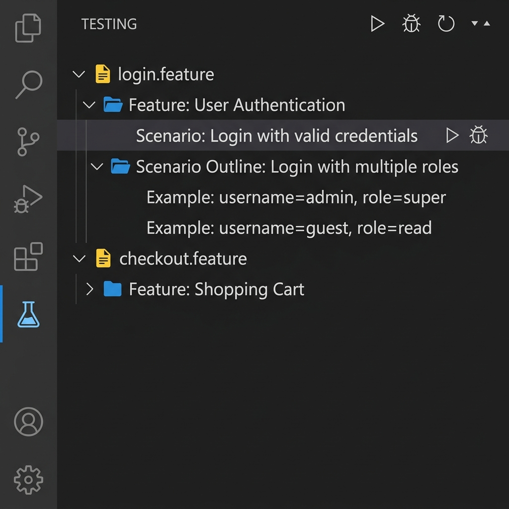
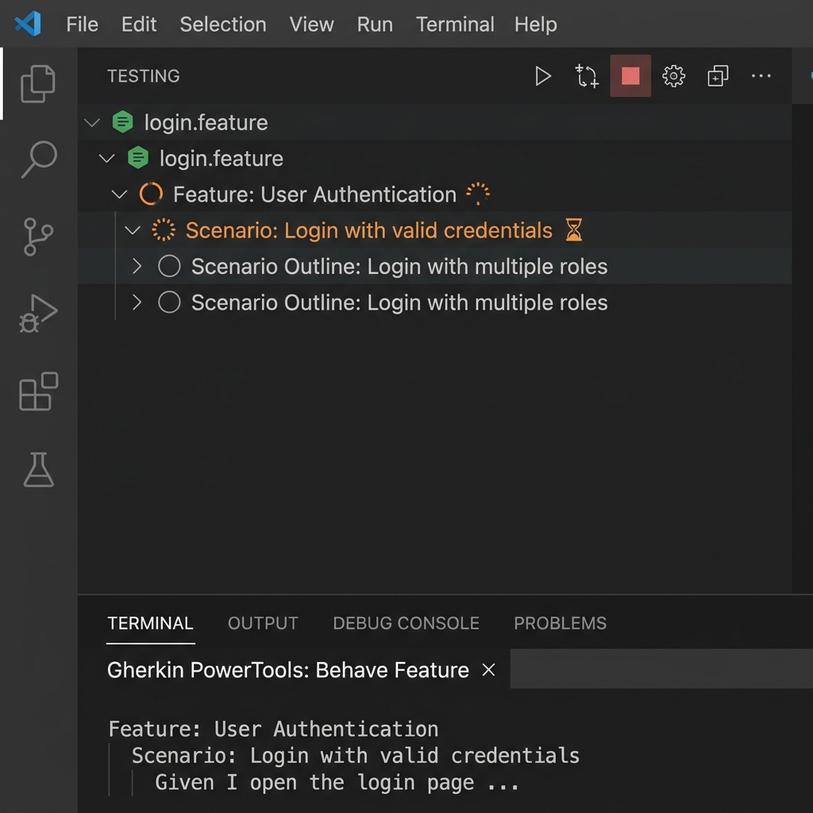
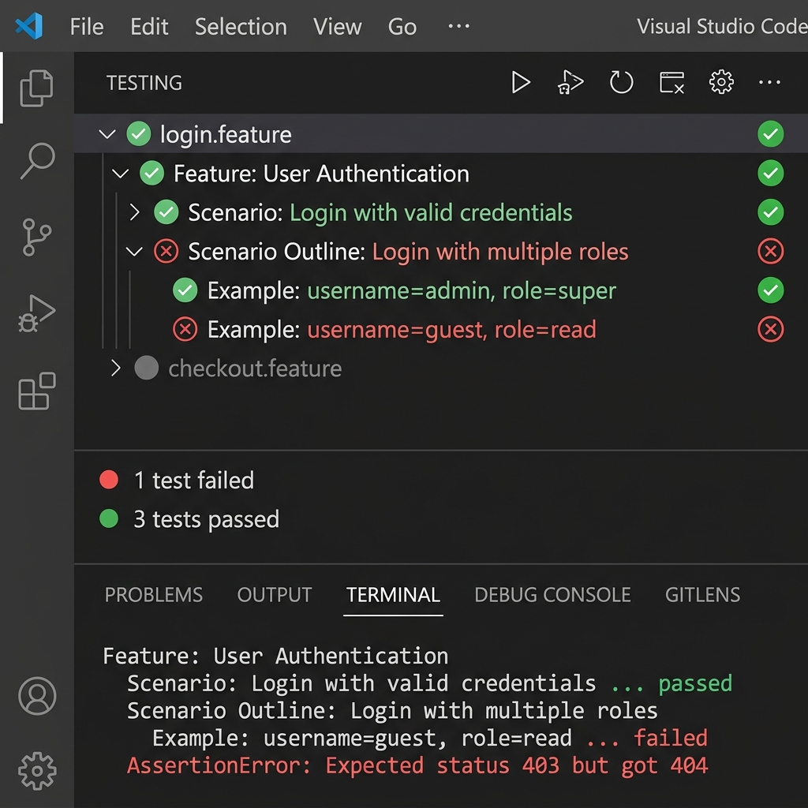
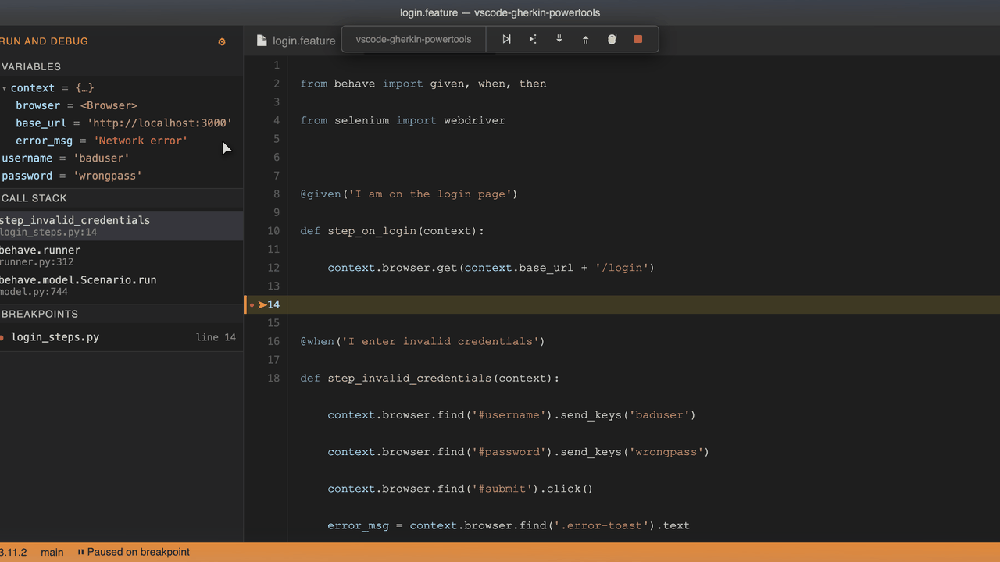
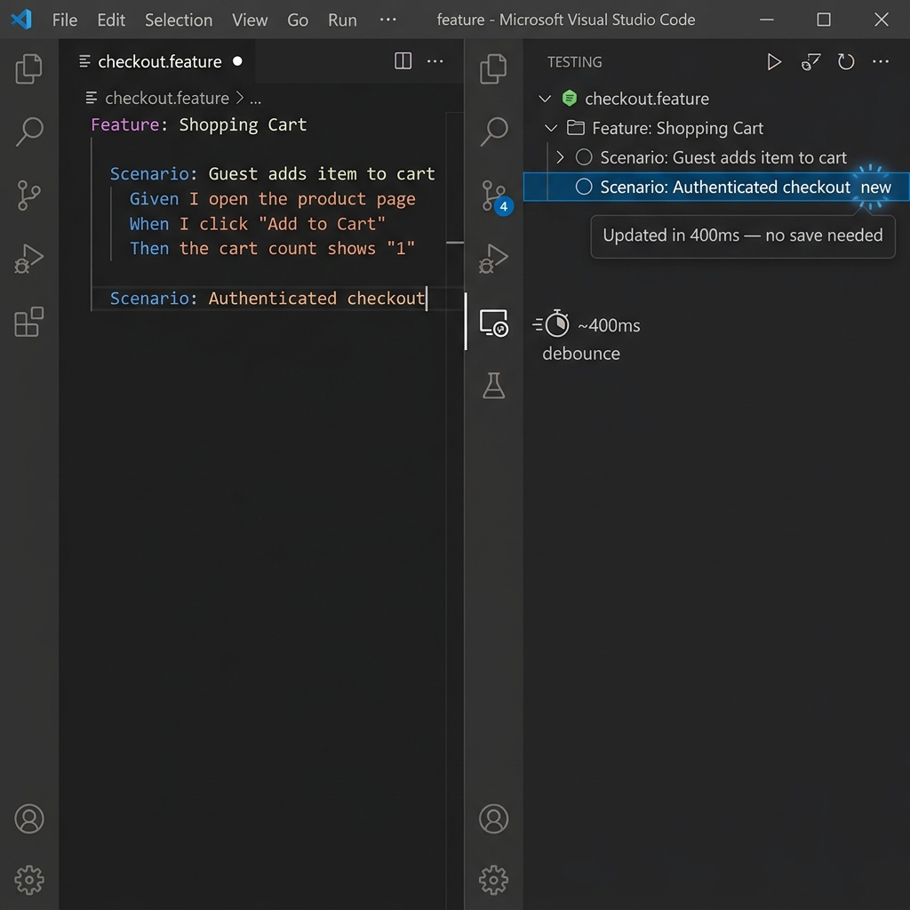

# 🚀 Behave Execution via Test Explorer

Run and debug your Behave tests directly from VS Code's built-in **Testing** sidebar, without switching to the terminal.

---

## How to Open the Test Explorer

| Method | Action |
|--------|--------|
| **Keyboard** | <kbd>⌘⇧T</kbd> (macOS) · <kbd>Ctrl+Shift+T</kbd> (Windows/Linux) |
| **Activity Bar** | Click the **🧪 beaker icon** on the left sidebar |
| **Command Palette** | `View: Show Test Explorer` |

---

## Tree Structure

Gherkin PowerTools registers a native `GherkinTestController` that maps your entire workspace into a structured hierarchy inside the Testing panel. Every `.feature` file, every `Feature`, `Scenario`, `Scenario Outline`, and individual `Example` row becomes an independently executable node.

<div align="center">
  
</div>

Every node in the tree is independently executable. Click `▶` next to any item to run only that file, feature, rule, scenario, or individual example row. Hover a row to reveal its `▶ Run` and `🐞 Debug` inline action buttons.

---

## Run Profiles

The Test Explorer exposes two run profiles selectable from the Testing panel toolbar:

| Profile | Icon | Behavior |
|---------|------|----------|
| **▶ Run** | ▶ | Executes selected tests as Behave Tasks (visible in the Terminal panel). Shows pass ✅ / fail ❌ badges after completion. |
| **🐞 Debug** | 🐞 | Launches the Python debugger. Breakpoints in your `steps/*.py` files are fully respected. Badge updates after the session terminates. |

---

## How Execution Works

### `▶ Run`

Executes the selected feature or scenario in a VS Code **Background Task** (visible in the Terminal panel → **Tasks**).

**Internal steps:**

1. **Interpreter resolution** — The extension queries the `ms-python.python` extension for the currently active Python interpreter. This guarantees that your virtual environment, `conda` environment, or DevContainer Python is used automatically. Falls back to the configured `behave.command` if the Python extension is not available.
2. **Secure argument construction** — Arguments are built as an **array** and passed to `vscode.ProcessExecution` directly — never via a raw shell string. This completely prevents shell injection attacks, even for file paths containing spaces, quotes, or special characters.
3. **Line-level targeting** — The exact line number is appended to the path argument (e.g. `["./features/login.feature:12"]`), so Behave executes only that specific scenario.
4. **Duplicate guard** — If the same scenario is already running, the extension shows a warning instead of launching a duplicate process.

While the test runs, the tree shows a spinning indicator and the Terminal panel streams Behave's live output:

<div align="center">
  
</div>

> **⚠️ Important:** A workspace folder **must be open** for execution to work safely. The extension uses `vscode.workspace.getWorkspaceFolder(uri)` to resolve relative paths. Opening a lone `.feature` file without a workspace will show an error.

---

### Test Results — Passed & Failed Badges

Once execution completes, each node updates to show its result. Green ✅ means the scenario passed; red ❌ means it failed. The summary row below the tree shows how many tests passed and failed.

#### Viewing Historical Execution Output (New)

With Gherkin PowerTools, you don't need to scroll endlessly through a terminal to find out why an older test failed. Every failed execution automatically captures the precise terminal output and embeds it inside the Test Explorer history. 

Simply click on any ❌ failed node in the tree to open the **Test Results** panel natively in VS Code. 

<div align="center">
  
</div>

**Simulation of Embedded Test Output:**

```text
TEST RESULTS (❌ Invalid login credentials)
---------------------------------------------------------
Behave exited with code 1. Output captured below:

Feature: User Login
  Scenario: Invalid login credentials
    Given I am on the login page ... passed
    When I enter invalid credentials ... passed
    Then I should see an error message ... failed
    
    AssertionError: Expected 'Invalid user', but got 'Unknown Error'
      File "features/steps/login_steps.py", line 12, in step_impl
        assert error == "Invalid user"
---------------------------------------------------------
```

> **💡 Tip:** Click any ❌ failed node and use the **▶ Run** button to re-run only that failing test. This makes it extremely fast to iterate on a broken scenario without re-running the entire suite.

---

### `🐞 Debug`

Launches a Behave debug session using the official VS Code Python debugger, allowing you to **set breakpoints in your Python step definitions** and pause execution mid-test.

**Internal steps:**

1. The extension dynamically constructs a `DebugConfiguration` of type `python` targeting Behave via `-m behave`.
2. It launches the session using `vscode.debug.startDebugging()` — no `launch.json` needed.
3. Your breakpoints in `steps/*.py` will pause execution, letting you inspect `context`, step arguments, and call stacks.

When the debugger pauses at a breakpoint, VS Code opens the matching Python step file at the exact line. The orange status bar confirms the debug session is active. You can inspect variables, evaluate expressions in the Debug Console, and use step-over/step-into controls to trace execution:

<div align="center">
  
</div>

> **⚠️ Important:** The **Python extension** (`ms-python.python`) or **Debugpy extension** (`ms-python.debugpy`) must be installed. If neither is found, the extension will show an error with a direct link to the Marketplace install page.

#### Debugging Limitations

> **⚠️ Warning:**
> **Scenario Outlines:** When debugging an individual example row, Behave resolves the scenario by **line number**. If Behave's line-number resolution is disabled, it falls back to name matching — which may match multiple scenarios with the same name across files. Ensure your scenario names are unique.
>
> **Rule Backgrounds:** Scenarios nested inside a `Rule` block may trigger grouping behaviors in Behave's runner when launched via a debug adapter, potentially executing more scenarios than intended.

---

## Test State Lifecycle

```
[Enqueued 🔄] → [Running ⏳] → [Passed ✅]
                             ↘ [Failed ❌]
                             ↘ [Cancelled —]
```

The controller uses VS Code's `TestRun` API to transition each item through these states. Internally, it waits for the correct platform event depending on the active profile:

| Profile | Event listened | Why |
|---------|----------------|-----|
| `▶ Run` | `onDidEndTaskProcess` | VS Code Tasks emit this event with an exit code when the process terminates. |
| `🐞 Debug` | `onDidTerminateDebugSession` | Debug sessions emit a separate event, never `onDidEndTaskProcess`. Using the wrong event would leave the spinner active for 5 minutes. |

> **💡 Tip:** **Cancellation:** Press the **⏹ Stop** button in the Testing panel toolbar at any time. The extension respects VS Code's `CancellationToken` and immediately stops launching new scenarios. Any already-running Behave process can also be stopped from the Terminal panel.

---

## Real-Time Tree Updates

The tree refreshes **as you type** — no save required.

The controller subscribes to `vscode.workspace.onDidChangeTextDocument` with a **400 ms debounce** per file URI. After 400 ms of inactivity, it re-parses the in-memory document buffer and updates the tree atomically. This means you see new scenario nodes appear in the Testing panel the moment you finish typing their name — no Ctrl+S needed.

<div align="center">
  
</div>

| Action | Tree behavior |
|--------|--------------|
| Type a new `Scenario:` line | New node appears within ~400 ms |
| Rename a scenario | Label updates without saving |
| Delete a scenario block | Node disappears without saving |
| Create a new `.feature` file | Node added (via `FileSystemWatcher`) |
| Delete a `.feature` file on disk | Node removed (via `FileSystemWatcher`) |

> **📝 Note:** The `FileSystemWatcher` (`**/*.feature`) handles **disk-level** events (external tools, git checkouts, file renames). The `onDidChangeTextDocument` listener handles **in-editor** changes. Both are active simultaneously and complement each other.

---

## Configuration Reference

> **📝 Note:** All settings also accept project-level overrides via `.gherkin-powertoolsrc.json`. See the [Configuration documentation](../configuration.md) for the full precedence rules.

### `gherkinPowerTools.behave.command`

The base command used to invoke Behave.

- **Type:** `string`
- **Default:** `"behave"`
- **Used when:** The Python extension is not installed, or no active interpreter is detected.
- **Examples:**

  | Environment | Value |
  |-------------|-------|
  | System `behave` | `"behave"` *(default)* |
  | Poetry | `"poetry run behave"` |
  | Pipenv | `"pipenv run behave"` |
  | Custom script | `"./scripts/run_tests.sh"` |

### `gherkinPowerTools.behave.additionalArguments`

Extra flags appended to every Behave invocation.

- **Type:** `array` of `string`
- **Default:** `[]`
- **Examples:**

  ```json
  // Run only @smoke and suppress captured output
  "gherkinPowerTools.behave.additionalArguments": ["--tags=@smoke", "--no-capture"]

  // Use the progress formatter with verbose output
  "gherkinPowerTools.behave.additionalArguments": ["--format", "progress", "--verbose"]
  ```

---

### Full Configuration Example

**`.gherkin-powertoolsrc.json`** (recommended for teams — commit to source control):

```json
{
    "behave": {
        "command": "poetry run behave",
        "additionalArguments": ["--no-capture", "--format", "progress"]
    }
}
```

**`.vscode/settings.json`** (personal workspace overrides):

```jsonc
{
  "gherkinPowerTools.behave.command": "poetry run behave",
  "gherkinPowerTools.behave.additionalArguments": ["--no-capture"],

  // Enable Format on Save while you're here
  "[feature]": {
    "editor.defaultFormatter": "carloscamara.vscode-gherkin-powertools",
    "editor.formatOnSave": true
  }
}
```

---

## Troubleshooting

### ❓ Tests run with the wrong Python environment

**Cause:** The extension picks the interpreter from the `ms-python.python` extension. If you have multiple environments, the wrong one may be active.

**Fix:** Click the interpreter badge in the VS Code status bar (bottom right) and select the correct environment. The extension will pick it up automatically on the next run — no restart needed.

---

### ❓ "A workspace folder must be open to execute Behave tests safely"

**Cause:** You opened a single `.feature` file directly (without a folder in the workspace).

**Fix:** Use **File → Open Folder** to open your project root. The extension needs a workspace folder to resolve relative paths like `./features/login.feature:12`.

---

### ❓ The debug session launches but no breakpoints are hit

| Cause | Fix |
|-------|-----|
| Python extension not installed | Install `ms-python.python` from the Marketplace |
| Wrong interpreter active | Switch interpreter via the status bar |
| `justMyCode: true` filtering out Behave internals | The extension sets `justMyCode: false` automatically |
| Breakpoint in an uncovered step | Verify that the step text matches a `@given`/`@when`/`@then` decorator |

---

### ❓ The test spinner doesn't clear after debugging

This is a known resolved issue. Ensure you are on the latest version of Gherkin PowerTools. In older versions, `onDidEndTaskProcess` was incorrectly used for debug sessions (which never fire that event). The fix introduces `onDidTerminateDebugSession` for debug runs.

---

### ❓ The Test Explorer tree is outdated / missing scenarios

**Possible causes:**

- The file is brand new and the extension hasn't discovered it yet → Open the file in the editor, or trigger `Reload Window`.
- A glob pattern is excluding your file → Run `Gherkin: Diagnose Workspace` from the Command Palette to inspect discovery.
- The file has severe syntax errors preventing parsing → Fix the Gherkin syntax and the tree will recover automatically.
